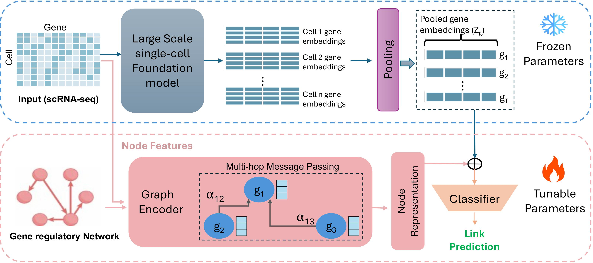

# scRegNet: Prediction of Gene Regulatory Connections with Joint Single-Cell Foundation Models and Graph-Based Learning

We provide PyTorch implementation for scRegNet that combines single-cell foundation models and graph-based learning to predict gene regulatory connections.

<p align="center">
  
</p>

## Installation

For training, a GPU is strongly recommended.

#### PyTorch

The code is based on PyTorch. You can find installation instructions [here](http://pytorch.org/).

#### Dependencies
* Python == 3.10
* PyTorch == 2.4.1
* scikit-learn == 1.5.2
* numpy == 1.20.3
* optuna == 4.0.0

[Optional] We recommend using [wandb](https://wandb.ai/) for logging and visualization.

```bash
pip install wandb
```
**Note: PyTorch 2.4.1 and CUDA 12.4 were used during development.**

## Desription

We use seven publicly available scRNA-seq benchmark datasets by BEELINE (Pratapa et al., 2020) for gene regulatory link prediction from single-cell transcriptomic data. We use the same data split in paper [GENELink](https://github.com/zpliulab/GENELink/tree/main) for a fair comparision. The repository is organised as follows:

* data/: contains the benchmark datasets for running demo experiments
* out/: contains our trained model weights for scRegNet(w/ Geneformer) using GCN as the GNN backbone.
* src/: contains our source code for scRegNet.
  * inference.py: evaluation code for gene regulatory link prediction.
  * models.py: contains our model scRegNet.  
  * utils.py: contains tool functions for preprocessing data, and metrics for evaluation, etc.
  * train.py: code for training a new model.
  * optuna/: sub-directory of codes for hyperparameter tuning using optuna
* scFM/: contains the gene level features extracted from single-cell foundation models. You can download the Geneformer embeddings for demo experiments from [here](https://drive.google.com/drive/folders/1xnh4ixJwx1kzmO98FmGUvy5S7uqLW-yR?usp=sharing)


## Running experiments

### Demo
```bash
$ git clone this-repo-url
$ cd scRegNet
$ python src/inference.py
```

## Train
```bash
$ bash gnn_hp.sh tf_500_hESC GCN hESC 500 Geneformer
```

## Acknowledgements

We sincerely thank the authors of following open-source projects:

- [Geneformer](https://huggingface.co/ctheodoris/Geneformer)
- [scFoundation](https://github.com/biomap-research/scFoundation)
- [scBERT](https://github.com/TencentAILabHealthcare/scBERT)
- [Optuna](https://github.com/optuna/optuna)
- [BEELINE](https://github.com/Murali-group/Beeline)
